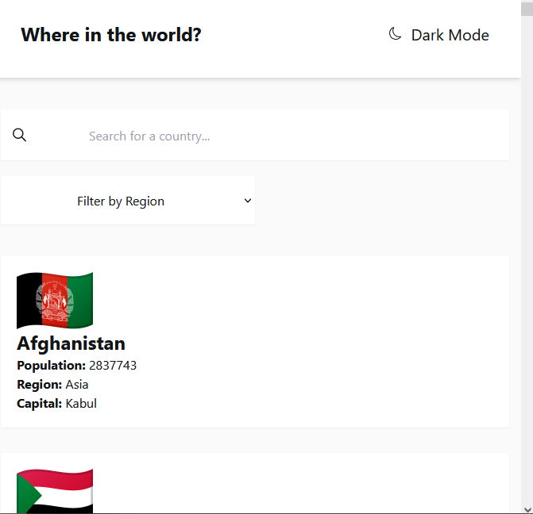
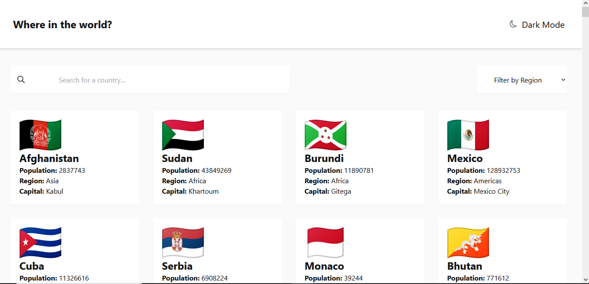

# Frontend Mentor - REST Countries API with color theme switcher solution

This is a solution to the [REST Countries API with color theme switcher challenge on Frontend Mentor](https://www.frontendmentor.io/challenges/rest-countries-api-with-color-theme-switcher-5cacc469fec04111f7b848ca). Frontend Mentor challenges help you improve your coding skills by building realistic projects. 

## Table of contents

- [Frontend Mentor - REST Countries API with color theme switcher solution](#frontend-mentor---rest-countries-api-with-color-theme-switcher-solution)
  - [Table of contents](#table-of-contents)
  - [Overview](#overview)
    - [The challenge](#the-challenge)
    - [Screenshot](#screenshot)
    - [Links](#links)
  - [My process](#my-process)
    - [Built with](#built-with)
    - [What I learned](#what-i-learned)
    - [Continued development](#continued-development)
    - [Useful resources](#useful-resources)
  - [Author](#author)
  - [Acknowledgments](#acknowledgments)
## Overview

### The challenge

Users should be able to:

- See all countries from the API on the homepage
- Search for a country using an `input` field
- Filter countries by region
- Click on a country to see more detailed information on a separate page
- Click through to the border countries on the detail page
- Toggle the color scheme between light and dark mode *(optional)*

### Screenshot

Mobile:

Desktop:

### Links

- Solution URL: [mySolution](https://www.frontendmentor.io/solutions/a-country-search-app-made-with-next-zustand-and-tailwind-DJW907tWaQ)
- Live Site URL: [My live site](https://country-search-purplehippo911.vercel.app/)

## My process

### Built with

- Semantic HTML5 markup
- Tailwind CSS
- Flexbox
- CSS Grid
- Mobile-first workflow
- [React](https://reactjs.org/) - JS library
- [Next.js](https://nextjs.org/) - React framework
- [Zustand](https://docs.pmnd.rs/zustand/getting-started/introduction) - React state management

### What I learned
I got to brush up on my knowledge about array methods, because I was working a lot with them, when I was rendering the country's information from the API. Learnt some basic NextJS and replaced `img`-element with Next's `Image`-element, to easier render images. Also got to learn some about object methods.

### Continued development
I'll focus on learning React Native and Firebase to make a productivity app. 

### Useful resources

- [NextJS Crashcourse by NetNinja](https://www.youtube.com/playlist?list=PL4cUxeGkcC9g9gP2onazU5-2M-AzA8eBw) - This helped me get started with NextJS. I really liked this channel and will use it going forward.

## Author

- Website - [Purplehippo's website](https://purplehipposwebsite.netlify.app)
- Frontend Mentor - [@purplehippo911](https://www.frontendmentor.io/profile/purplehippo911)
- Twitter - [@muggie43](https://twitter.com/muggie43)

## Acknowledgments

This guys version of the app helped me when I was stuck:
[Yusufneeson](https://github.com/yusufneeson/rest-countries/blob/main/src/components/Countries/Countries.jsx)

Where I got this icon from: 
[Left arrow icons created by Freepik - Flaticon](https://www.flaticon.com/free-icons/left-arrow)
